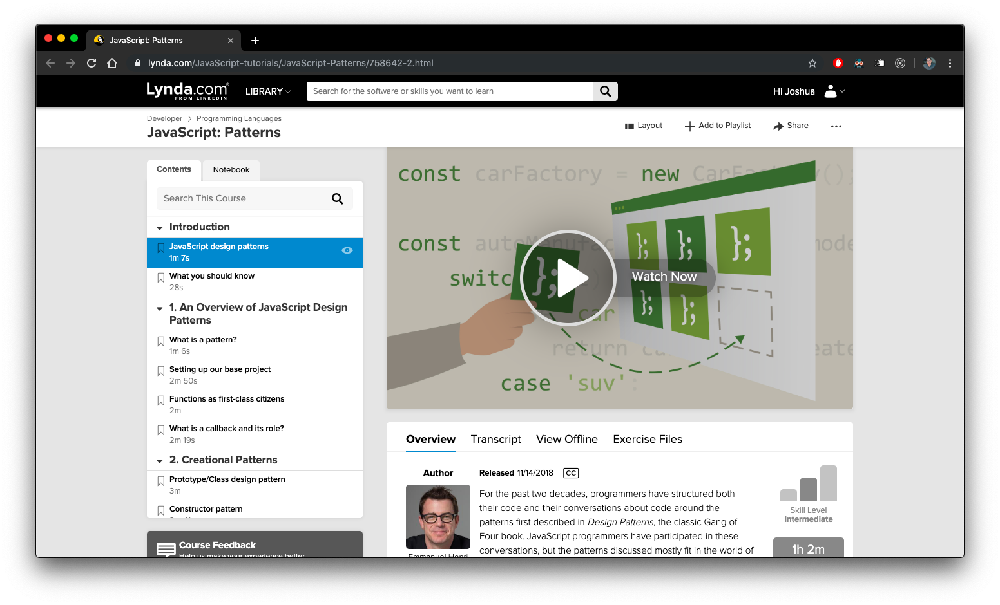

This is repository for the JavaScript: Design Patterns course on Lynda.com

This course demonstrates how common design patterns can be implemented in JavaScript

[JavaScript: Design Patterns](https://www.lynda.com/JavaScript-tutorials/JavaScript-Patterns/758642-2.html)

